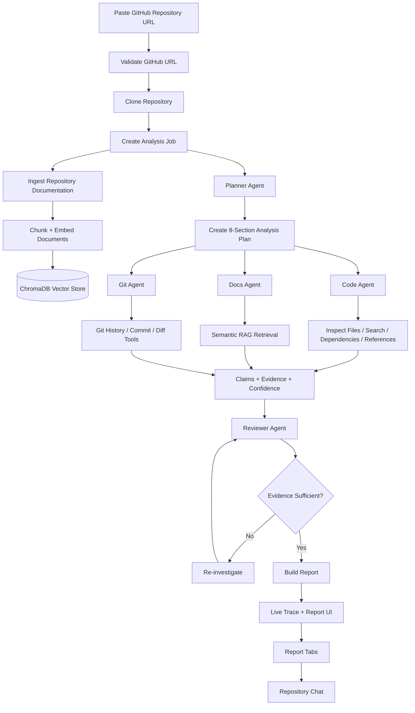

<div align="center">


# RepoPilot

### AI-Powered GitHub Repository Analysis Platform

**Turn an unfamiliar repository into an evidence-backed engineering report — from clone to architecture, code flow, dependencies, documentation, Git history, developer guidance, and code concerns.**

<br>

[](https://www.python.org/)
[](https://fastapi.tiangolo.com/)
[](https://nextjs.org/)
[](https://www.typescriptlang.org/)
[](https://www.trychroma.com/)
[](https://developer.mozilla.org/en-US/docs/Web/API/WebSocket)
[](LICENSE)

</div>

---

## 🚀 What is RepoPilot?

RepoPilot is an **AI-powered repository intelligence tool** for developers who need to understand an existing codebase quickly.

Instead of manually opening dozens of files, reading the README, tracing imports, checking Git history, and figuring out how the application works, RepoPilot coordinates specialist agents to investigate the repository and produce a structured report.

### The core idea

> **Ask the repository questions, inspect real evidence, verify the evidence, and present the result in one developer-friendly interface.**

RepoPilot is designed around **evidence-backed analysis** rather than free-form AI summarization. Claims returned by agents include repository file evidence, and a reviewer agent verifies that cited files and snippets actually exist.

---

## ✨ Highlights

<table>
<tr>
<td width="50%">

### 🧠 Multi-Agent Analysis
Specialist agents investigate different dimensions of the repository:
- Code & architecture
- Documentation
- Git history
- Developer workflow
- Potential concerns

</td>
<td width="50%">

### 🔎 Evidence-Backed Claims
AI-generated findings can include:
- File paths
- Source snippets
- Line information when available
- Confidence scores

</td>
</tr>
<tr>
<td>

### 🔄 RAG-Powered Documentation Analysis
Repository documentation is ingested into a local ChromaDB vector store and retrieved semantically when documentation-focused questions are asked.

</td>
<td>

### 🛡️ Reviewer Agent
A dedicated reviewer checks:
1. Whether cited files exist
2. Whether cited snippets occur in those files
3. Whether the evidence supports the claim

</td>
</tr>
<tr>
<td>

### ⚡ Parallel Report Generation
Independent report sections run concurrently, reducing total analysis time compared with strictly sequential agent execution.

</td>
<td>

### 📡 Live Agent Trace
The frontend receives live workflow events over WebSocket so you can see what RepoPilot is doing while the report is being generated.

</td>
</tr>
<tr>
<td>

### 💬 Repository-Aware Chat
After analysis, ask follow-up questions about the repository. The planner selects an appropriate specialist agent and the answer is reviewed before being returned.

</td>
<td>

### 📄 Structured Engineering Report
Explore dedicated tabs for:
- Overview
- Architecture
- Code Flow
- Dependencies
- Docs
- Git History
- Dev Guide
- Concerns

</td>
</tr>
</table>

---

# 🧭 End-to-End Process

The complete RepoPilot workflow looks like this:



## 🔬 What happens internally?

### 1. Repository intake

You submit a GitHub URL through the Next.js frontend.

The backend:

1. Validates the GitHub URL.
2. Clones the repository.
3. Creates a background analysis job.
4. Returns a `job_id` and `repo_id`.

### 2. Repository ingestion

RepoPilot ingests repository documentation into its RAG pipeline.

The ingestion layer:

- Walks relevant repository files
- Splits content into chunks
- Generates embeddings
- Stores the vectors in ChromaDB

This gives the documentation agent a semantic search layer instead of relying only on the model's context window.

### 3. Planning

The planner creates an analysis plan covering:

| Section | Primary Agent |
|---|---|
| Overview | Code Agent |
| Architecture | Code Agent |
| Code Flow | Code Agent |
| Dependencies | Code Agent |
| Documentation | Docs Agent |
| Git History | Git Agent |
| Developer Guide | Docs Agent |
| Concerns | Code Agent |

### 4. Specialist investigation

Each independent section is investigated by the appropriate agent.

The **Code Agent** can reason over repository files and use filesystem/search/dependency/reference tools.

The **Docs Agent** retrieves relevant documentation chunks through RAG before asking the LLM to answer.

The **Git Agent** uses Git-specific tools to inspect history, commits, and diffs.

### 5. Evidence generation

Agents return structured claims containing:

```json
{
  "text": "The repository uses FastAPI as its backend framework.",
  "evidence": [
    {
      "file_path": "backend/app/main.py",
      "line_range": null,
      "snippet": "app = FastAPI(...)"
    }
  ],
  "confidence": 0.92
}
```

### 6. Evidence verification

The reviewer agent independently checks the generated evidence.

It verifies:

- File existence
- Snippet presence
- Logical support for the claim

If a claim is insufficient, RepoPilot can re-run the specialist investigation with the review feedback.

The workflow allows up to **2 retries per section**.

### 7. Parallel execution

The eight independent report sections are executed concurrently using a thread pool.

This is a major performance optimization because architecture, dependencies, documentation, Git history, etc. do not need to wait for one another.

### 8. Live trace

During analysis, backend events are published through the trace bus and streamed to the browser using:

```text
WebSocket
/ws/trace/{job_id}
```

The UI can therefore show agent/tool activity while the report is being built.

### 9. Report presentation

Once all sections finish, the backend constructs a structured `ReportResponse`.

The frontend presents it through dedicated report tabs with evidence expanders and confidence indicators.

### 10. Follow-up questions

The chat endpoint accepts a repository ID and natural-language question.

The question planner selects the relevant specialist agent, gathers evidence, invokes the reviewer, and returns the combined answer.

---

# 🏗️ Architecture

```text
┌─────────────────────────────────────────────────────────────┐
│                        Next.js Frontend                     │
│                                                             │
│  Repo Input → Live Trace → Report Tabs → Evidence → Chat   │
└──────────────────────────────┬──────────────────────────────┘
                               │ HTTP + WebSocket
                               ▼
┌─────────────────────────────────────────────────────────────┐
│                         FastAPI Backend                     │
│                                                             │
│  /api/analyze     /api/report     /api/chat                │
│  /ws/trace/{id}                                             │
└───────────────┬───────────────────────┬─────────────────────┘
                │                       │
                ▼                       ▼
      ┌──────────────────┐     ┌────────────────────────┐
      │ Orchestration    │     │ GitHub Client           │
      │                  │     │ Clone + repository I/O  │
      │ Planner           │     └────────────────────────┘
      │ Job Manager      │
      │ Trace Bus        │
      │ Parallel Workers │
      └────────┬─────────┘
               │
       ┌───────┼───────────────┐
       ▼       ▼               ▼
 ┌─────────┐ ┌─────────┐ ┌────────────┐
 │Code     │ │Docs     │ │Git         │
 │Agent    │ │Agent    │ │Agent       │
 └────┬────┘ └────┬────┘ └─────┬──────┘
      │           │             │
      ▼           ▼             ▼
 Filesystem   RAG / ChromaDB   Git Tools
 Search       Retrieval        Commits/Diffs
 Dependencies
 References
      │           │             │
      └───────────┼─────────────┘
                  ▼
          ┌───────────────┐
          │ Reviewer Agent│
          └───────┬───────┘
                  ▼
           Verified Claims
                  │
                  ▼
            Structured Report

                  ▲
                  │
        OpenAI-compatible API
                  │
                  ▼
             OmniRoute
                  │
                  ▼
       Configured LLM Provider(s)
```

---

# 🤖 Agent System

## Planner Agent

The planner determines which specialist should handle each part of the analysis.

For a full report it creates eight analysis steps.

For chat, it dynamically creates a question-specific plan.

---

## Code Agent

The Code Agent focuses on understanding the actual implementation.

Typical responsibilities:

- Project overview
- Architecture
- Code flow
- Dependencies
- Code concerns
- File relationships
- Symbol references
- Source inspection

It can iteratively request tools from the backend before producing its final structured claim.

---

## Documentation Agent

The Docs Agent focuses on repository documentation.

It uses the RAG pipeline to retrieve relevant chunks and then asks the LLM to answer using those chunks as context.

This is especially useful for questions involving:

- README files
- Setup instructions
- Developer workflow
- Configuration
- Existing documentation
- Project conventions

---

## Git Agent

The Git Agent specializes in repository history.

It can inspect:

- Recent commit history
- Individual commits
- Commit diffs
- Repository development patterns

This makes Git history a first-class part of repository understanding rather than an afterthought.

---

## Reviewer Agent

The reviewer acts as a verification layer between investigation and presentation.

Its job is to challenge agent output instead of blindly trusting it.

### Verification loop

```text
Agent Claim
    │
    ▼
Check cited file paths
    │
    ▼
Check cited snippets
    │
    ▼
Does evidence support claim?
    │
 ┌──┴─────────┐
 │            │
 YES          NO
 │            │
 ▼            ▼
Accept      Retry investigation
 │            │
 └──────┬─────┘
        ▼
     Final claim
```

---

# 🔎 RAG Pipeline

RepoPilot includes a retrieval-augmented generation pipeline built around ChromaDB.

```text
Repository
    │
    ▼
Document Ingestion
    │
    ▼
Chunking
    │
    ▼
Embeddings
    │
    ▼
ChromaDB
    │
    ▼
Semantic Retrieval
    │
    ▼
Relevant Context
    │
    ▼
Documentation Agent
    │
    ▼
Evidence-backed Answer
```

The main RAG components are:

```text
backend/app/rag/
├── embeddings.py
├── ingest.py
├── retriever.py
└── vector_store.py
```

---

# 🧰 Repository Tools

RepoPilot exposes repository operations through an internal MCP-style tool layer.

```text
backend/app/mcp_server/
├── server.py
└── tools/
    ├── dependencies.py
    ├── filesystem.py
    ├── git.py
    └── search.py
```

These tools allow agents to perform grounded repository investigation rather than relying solely on generated assumptions.

Examples include:

- File listing
- File reading
- Repository search
- Symbol/reference search
- Dependency inspection
- Git history inspection
- Commit inspection
- Commit diff inspection

---

# 📊 Report Sections

After a successful analysis, RepoPilot produces eight major sections.

### 1. Overview

Answers:

- What does the project do?
- What technologies does it use?
- What are the main entry points?
- What is the overall purpose?

### 2. Architecture

Explains:

- Directory structure
- Major modules
- Component relationships
- Architectural patterns
- Important boundaries

### 3. Code Flow

Traces how an important operation moves through the codebase.

For example:

```text
Request
  ↓
API Route
  ↓
Service / Orchestrator
  ↓
Business Logic
  ↓
Data / External Service
  ↓
Response
```

### 4. Dependencies

Identifies important packages and explains what they are used for.

### 5. Documentation

Analyzes existing project documentation and identifies important setup/configuration information.

### 6. Git History

Surfaces repository development history, commits, and notable changes.

### 7. Developer Guide

Provides practical information for developers who need to understand or work on the project.

### 8. Concerns

Looks for potential:

- Code smells
- Architectural issues
- Security concerns
- Missing tests
- Dependency problems
- Maintainability risks

---

# 🖥️ Frontend

The frontend is built with:

- **Next.js 14**
- **React 18**
- **TypeScript**
- **Tailwind CSS**

Important UI components include:

```text
frontend/components/
├── AgentTraceLog.tsx
├── ArchitecturePanel.tsx
├── ChatMessage.tsx
├── ChatPanel.tsx
├── CodeFlowPanel.tsx
├── ConcernsPanel.tsx
├── ConfidenceBadge.tsx
├── DependenciesPanel.tsx
├── DevGuidePanel.tsx
├── DocsPanel.tsx
├── EvidenceExpander.tsx
├── GitHistoryPanel.tsx
├── OverviewPanel.tsx
├── RepoInputForm.tsx
├── ReportTabs.tsx
└── SectionPanel.tsx
```

The frontend provides:

- Repository URL input
- Live agent trace
- Structured report navigation
- Evidence expansion
- Confidence badges
- Repository chat
- Text report export

---

# ⚙️ Backend

The backend is built with:

- **Python 3.11+**
- **FastAPI**
- **Pydantic**
- **GitPython**
- **ChromaDB**
- **HTTPX**
- **WebSockets**

Main backend areas:

```text
backend/app/
├── agents/
├── api/
├── core/
├── evaluation/
├── github_client/
├── mcp_server/
├── models/
├── orchestration/
└── rag/
```

---

# 🔌 API

## Analyze a repository

```http
POST /api/analyze
```

Request:

```json
{
  "repo_url": "https://github.com/owner/repository"
}
```

Response:

```json
{
  "repo_id": "...",
  "job_id": "..."
}
```

---

## Health check

```http
GET /health
```

Example response:

```json
{
  "status": "ok",
  "llm_gateway": "http://localhost:20128/v1",
  "omniroute": "ok"
}
```

---

## Repository chat

```http
POST /api/chat
```

Request:

```json
{
  "repo_id": "...",
  "question": "How does authentication work?"
}
```

---

## Live analysis trace

```text
WebSocket /ws/trace/{job_id}
```

The frontend subscribes to this stream to display agent activity and completion/error events.

---

# 🔐 LLM Gateway

RepoPilot does **not** hard-code a specific LLM provider.

It communicates with an OpenAI-compatible local gateway:

**OmniRoute**

```text
RepoPilot
    │
    ▼
http://localhost:20128/v1
    │
    ▼
OmniRoute
    │
    ▼
Configured model/provider
```

This keeps model routing separate from repository-analysis logic.

The default configuration uses:

```env
OMNIROUTE_BASE_URL=http://localhost:20128/v1
OMNIROUTE_API_KEY=omniroute

LLM_MODEL=auto
LLM_MODEL_LITE=auto
```

> **Privacy note:** RepoPilot's application/backend runs locally, but LLM requests can leave your machine depending on how OmniRoute is configured. Review your OmniRoute/provider configuration before analyzing private or sensitive repositories.

---

# 🛠️ Installation

## Prerequisites

Install:

- Python 3.11+
- Node.js 18+
- Git
- OmniRoute

---

## 1. Clone RepoPilot

```bash
git clone <YOUR_REPOPILOT_REPOSITORY_URL>
cd RepoPilot
```

---

## 2. Start OmniRoute

Install it globally:

```bash
npm install -g omniroute
```

Start the gateway:

```bash
omniroute
```

Default endpoints:

```text
Dashboard: http://localhost:20128
API:       http://localhost:20128/v1
```

Keep OmniRoute running while RepoPilot is running.

---

# 🐍 Backend Setup

Open a new terminal:

### Windows PowerShell

```powershell
cd backend

python -m venv venv
venv\Scripts\Activate.ps1

pip install -r requirements.txt

Copy-Item .env.example .env

python run.py
```

### macOS / Linux

```bash
cd backend

python3 -m venv venv
source venv/bin/activate

pip install -r requirements.txt

cp .env.example .env

python run.py
```

Backend:

```text
http://localhost:8000
```

Health check:

```text
http://localhost:8000/health
```

### Why use `python run.py`?

RepoPilot clones repositories under the backend data directory.

A normal development server watcher can accidentally monitor those cloned files and restart the server during analysis.

`run.py` is preferred because it configures the development server to avoid watching the repository data directory.

---

# ⚛️ Frontend Setup

Open another terminal:

```bash
cd frontend
npm install
npm run dev
```

Open:

```text
http://localhost:3000
```

---

# 🔧 Environment Variables

Create:

```text
backend/.env
```

from:

```text
backend/.env.example
```

Available settings:

```env
# OmniRoute
OMNIROUTE_BASE_URL=http://localhost:20128/v1
OMNIROUTE_API_KEY=omniroute

# Optional: required for private GitHub repositories
GITHUB_TOKEN=

# Model routing
LLM_MODEL=auto
LLM_MODEL_LITE=auto

# Disable Chroma telemetry
ANONYMIZED_TELEMETRY=False
CHROMA_TELEMETRY=False
```

### Private repositories

For private GitHub repositories, configure:

```env
GITHUB_TOKEN=your_token_here
```

Do not commit `.env` or secrets to Git.

---

# ▶️ Running the Full Stack

You need three processes.

### Terminal 1 — LLM Gateway

```bash
omniroute
```

### Terminal 2 — Backend

```bash
cd backend

# Windows
venv\Scripts\Activate.ps1

# macOS/Linux
source venv/bin/activate

python run.py
```

### Terminal 3 — Frontend

```bash
cd frontend
npm run dev
```

Then open:

```text
http://localhost:3000
```

---

# 🧪 Evaluation

RepoPilot contains an evaluation module under:

```text
backend/app/evaluation/
```

Run:

```bash
cd backend
python -m app.evaluation.evaluator
```

The evaluation system provides test cases for checking repository-analysis behavior.

---

# 📁 Project Structure

```text
RepoPilot/
│
├── assets/
│   └── logo.svg
│
├── backend/
│   ├── app/
│   │   ├── agents/
│   │   │   ├── code_agent.py
│   │   │   ├── docs_agent.py
│   │   │   ├── git_agent.py
│   │   │   ├── planner.py
│   │   │   └── reviewer.py
│   │   │
│   │   ├── api/
│   │   │   ├── analyze.py
│   │   │   ├── chat.py
│   │   │   ├── report.py
│   │   │   └── trace_ws.py
│   │   │
│   │   ├── core/
│   │   │   ├── config.py
│   │   │   └── llm.py
│   │   │
│   │   ├── evaluation/
│   │   │   ├── evaluator.py
│   │   │   └── test_cases.py
│   │   │
│   │   ├── github_client/
│   │   │   └── client.py
│   │   │
│   │   ├── mcp_server/
│   │   │   ├── server.py
│   │   │   └── tools/
│   │   │       ├── dependencies.py
│   │   │       ├── filesystem.py
│   │   │       ├── git.py
│   │   │       └── search.py
│   │   │
│   │   ├── models/
│   │   │   └── schemas.py
│   │   │
│   │   ├── orchestration/
│   │   │   ├── job_manager.py
│   │   │   ├── trace_bus.py
│   │   │   └── workflow.py
│   │   │
│   │   └── rag/
│   │       ├── embeddings.py
│   │       ├── ingest.py
│   │       ├── retriever.py
│   │       └── vector_store.py
│   │
│   ├── .env.example
│   ├── requirements.txt
│   └── run.py
│
├── frontend/
│   ├── app/
│   │   ├── report/[repoId]/
│   │   │   └── page.tsx
│   │   ├── error.tsx
│   │   ├── layout.tsx
│   │   ├── not-found.tsx
│   │   └── page.tsx
│   │
│   ├── components/
│   │   ├── AgentTraceLog.tsx
│   │   ├── ArchitecturePanel.tsx
│   │   ├── ChatPanel.tsx
│   │   ├── CodeFlowPanel.tsx
│   │   ├── ConcernsPanel.tsx
│   │   ├── DependenciesPanel.tsx
│   │   ├── DevGuidePanel.tsx
│   │   ├── DocsPanel.tsx
│   │   ├── EvidenceExpander.tsx
│   │   ├── GitHistoryPanel.tsx
│   │   ├── OverviewPanel.tsx
│   │   ├── RepoInputForm.tsx
│   │   ├── ReportTabs.tsx
│   │   └── SectionPanel.tsx
│   │
│   ├── lib/
│   │   ├── api.ts
│   │   ├── exportReport.ts
│   │   ├── types.ts
│   │   └── useTraceSocket.ts
│   │
│   ├── package.json
│   └── tailwind.config.ts
│
└── README.md
```

---

# 🔁 Request Lifecycle

For a normal full analysis:

```text
Browser
  │
  │ POST /api/analyze
  ▼
FastAPI
  │
  ├── Validate URL
  ├── Clone repository
  └── Create job
        │
        ▼
   Background Workflow
        │
        ├── RAG ingestion
        ├── Planner
        │
        ├── Code Agent ─────┐
        ├── Docs Agent ─────┤
        ├── Git Agent ──────┤
        │                   │
        └── Parallel work ──┘
                    │
                    ▼
              Reviewer Agent
                    │
             ┌──────┴──────┐
             │             │
          Sufficient    Insufficient
             │             │
             │        Retry investigation
             │             │
             └──────┬──────┘
                    ▼
              ReportResponse
                    │
                    ▼
             Frontend Report
```

---

# 💬 Example Questions

Once a repository is analyzed, you can ask questions such as:

```text
How does authentication work in this project?
```

```text
Where is the main application entry point?
```

```text
Explain the request flow from the API endpoint to the database.
```

```text
What are the most important dependencies?
```

```text
Which files should I understand first as a new contributor?
```

```text
What are the biggest architectural concerns?
```

```text
What changed in the most recent commits?
```

```text
How do I run this project locally?
```

---

# 🎯 Why RepoPilot?

Traditional repository exploration requires manually combining several workflows:

```text
README reading
     +
File exploration
     +
Code search
     +
Dependency inspection
     +
Git history
     +
Architecture reasoning
     +
Documentation lookup
     +
Developer setup
```

RepoPilot combines those workflows into one analysis pipeline:

```text
             ┌─────────────────┐
             │ GitHub Repository│
             └────────┬────────┘
                      ▼
             ┌─────────────────┐
             │    RepoPilot    │
             └────────┬────────┘
                      ▼
       ┌─────────────────────────────┐
       │ Evidence-backed AI analysis │
       └──────────────┬──────────────┘
                      ▼
          ┌───────────────────────┐
          │ Engineering Knowledge │
          └───────────────────────┘
```

The goal is not simply to generate a summary.

The goal is to **reduce the time required to become productive in an unfamiliar codebase**.

---

# 🔒 Security & Privacy Considerations

RepoPilot is intended to run locally, but repository analysis may involve external LLM providers depending on your OmniRoute configuration.

Keep these practices in mind:

- Never commit `GITHUB_TOKEN`.
- Never commit `.env`.
- Avoid analyzing sensitive repositories through providers you do not trust.
- Review your OmniRoute routing configuration before processing private source code.
- Treat generated AI findings as analysis, not as an authoritative security audit.
- Verify critical conclusions against the cited repository evidence.

---

## Backend does not start

Verify the virtual environment:

### Windows

```powershell
venv\Scripts\Activate.ps1
```

### macOS/Linux

```bash
source venv/bin/activate
```

Then:

```bash
pip install -r requirements.txt
python run.py
```

---

## Frontend dependencies fail

Run:

```bash
cd frontend
npm install
npm run dev
```

---

## Analysis gets stuck

Make sure:

1. OmniRoute is running.
2. Backend is running on port `8000`.
3. Frontend is running on port `3000`.
4. The repository URL is valid.
5. Git is installed and available in `PATH`.
6. The backend was started using `python run.py` rather than a watcher that monitors cloned repository data.

---

# 🗺️ Future Improvements

Potential directions for RepoPilot include:

- Persistent job/database storage
- Authentication and multi-user support
- Incremental repository indexing
- Better large-repository chunking
- More language-aware static analysis
- Deeper dependency graphs
- Visual architecture diagrams
- Pull-request analysis
- Branch comparison
- Commit-to-code impact analysis
- CI/CD analysis
- Security scanning integrations
- More sophisticated evaluation benchmarks
- Cloud deployment support

---

# 🧑‍💻 Development Philosophy

RepoPilot is built around four principles:

### 1. Ground the model

Prefer repository evidence over unsupported model assumptions.

### 2. Separate responsibilities

Use specialist agents instead of one monolithic prompt for every task.

### 3. Verify before presenting

A reviewer layer checks generated evidence.

### 4. Make the reasoning observable

Live trace events show users what the system is investigating.

---

# ⭐ The RepoPilot Value Proposition

```text
                UNFAMILIAR REPOSITORY
                         │
                         ▼
                ┌─────────────────┐
                │     RepoPilot   │
                └─────────────────┘
                         │
        ┌────────────────┼────────────────┐
        ▼                ▼                ▼
      Code             Docs              Git
        │                │                │
        └────────────────┼────────────────┘
                         ▼
                    AI Analysis
                         │
                         ▼
                 Evidence Review
                         │
                         ▼
              ┌─────────────────────┐
              │ Engineering Report  │
              └─────────────────────┘
                         │
                         ▼
               Faster Codebase Onboarding
```

**RepoPilot turns repository archaeology into an interactive engineering workflow.**

---

## 📜 License

See the repository's `LICENSE` file for licensing information.

---

<div align="center">

### Built for developers who need to understand codebases faster.


**RepoPilot**

</div>
